# Munshi

**Your AI back office, in your pocket.** A team of seven approval-gated agents runs a
distributor's whole order-to-cash loop — orders, godown, deliveries, cash, khata,
suppliers, collections — inside one self-contained app: a phone app for every role,
a system of record you own, and a CI gate that proves nothing moves stock or money
without a human saying yes.

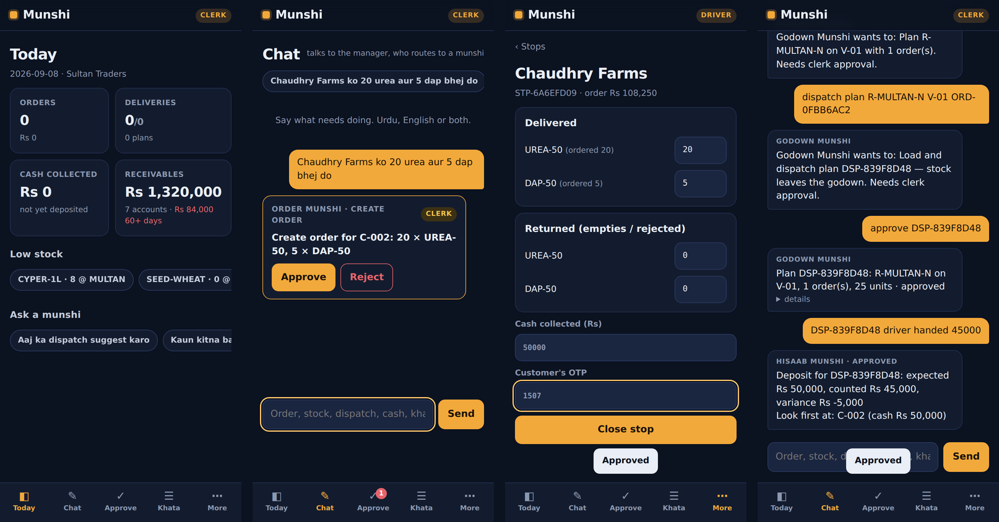

[](https://github.com/azamali992/munshi/actions/workflows/ci.yml)

Every distributor in Pakistan already has a *munshi* — the trusted clerk who takes the
orders, keeps the khata and chases the money. Munshi is that role as software: seven
specialist agents with one job each and one set of permissions each, a manager that
routes and never acts, and a system of record they all write to through a single door.

| | |
|---|---|
| **Try it** | `docker compose up` → open `http://localhost:8000` → tap a demo account (owner · clerk · driver · salesman) or *Create your business* |
| **Android** | signed APK on the [Releases](https://github.com/azamali992/munshi/releases) page — enters your server address once, then it's the app |
| **Docs** | [Architecture](docs/ARCHITECTURE.md) · [Security & threat model](docs/SECURITY.md) · [Deployment](docs/DEPLOYMENT.md) · [QA report](docs/QA.md) · [User guide](docs/user-guide.md) · [Business & pricing](docs/business/) · [Product research](docs/product/) |

## The team

| Agent | Does | Can write | Can never |
|---|---|---|---|
| **Order Munshi** | Reads orders in Urdu, English or mixed; matches to real SKUs; checks stock and khata; drafts the order | `create_order`, `confirm_order`, `cancel_order` (clerk approves; big orders need the owner) | touch stock, money |
| **Godown Munshi** | Allocates against real stock, plans dispatch onto routes and vehicles within capacity, moves stock between godowns | `allocate`, `plan`, `approve loading`, `transfer` (clerk); `adjust_stock` (owner) | promise stock that isn't there |
| **Delivery Munshi** | On the driver's phone: stops in order, closes each with what was delivered, returned, cash taken | `close_stop` — gated by the **customer's OTP**, not the app | close a stop without the code |
| **Hisaab Munshi** | Reconciles the driver's cash against his stops, records payments received at the office (cash, bank, JazzCash, Easypaisa, cheque) and expenses | `record_deposit`, `record_payment`, `record_expense` (clerk); `credit_note` (owner) | post silently |
| **Khareed Munshi** | Receives stock from suppliers into the godown with the bill on their account; tracks what you owe | `record_purchase` (clerk); `pay_supplier` (owner) | pay without a method and reference |
| **Wasooli Munshi** | Ages receivables, drafts reminders in the right tone, logs promises to pay and flags the broken ones | `draft`/`send_reminder`, `log_promise` (clerk) | write free text to a customer |
| **Report Munshi** | Sales, margin, collections, cashbook, stock valuation, slow stock, top customers, a product's movement history | **nothing** — read-only | change anything |
| **Manager** | Routes every message to one specialist | **nothing** | act |

Four roles, four apps in one: the **owner** gets Today, approvals, reports, staff and
setup; the **clerk** gets a desk (drafts to confirm → confirmed to allocate → allocated to
plan → vans to reconcile); the **salesman** books drafts at the counter and logs promises;
the **driver** gets his stops, a big cash field and a four-digit code — and it works with
no signal, syncing when one comes back.

## What makes it a product, not a demo

- **Approval by construction.** One risk registry (`safety/risk.py`) declares every tool's
  tier. LangChain's `HumanInTheLoopMiddleware` is generated from it, so any state-changing
  tool pauses the agent's graph and surfaces an approval card. The action has not run. A
  human with the right role taps Approve or Reject; the agent resumes from a SQLite
  checkpoint — a server restart loses nothing. Registering a tool without a tier raises.
- **Roles are tool boundaries.** A driver's Order Munshi has no `create_order` tool bound;
  a salesman can book a draft but has no `confirm_order`; a clerk can't even request a
  credit note or a supplier payment. Refusing is the only thing those agents *can* do.
- **The customer holds the key.** Every stop is closed against a four-digit code issued
  when the plan is approved and sent to the customer. The driver never sees it.
- **A real system of record.** SQLite, one file per business, every invariant in one
  repository package: credit limits hold orders, capacity blocks plans, stock reserves on
  allocation and leaves on loading, every movement is in a stock ledger, returns restock,
  invoices and payments post on close, aging applies payments oldest-first the way a munshi
  does, a short deposit is attributed to the stop most likely responsible, purchases put
  the bill on the supplier and update cost price, and every write names the human behind it.
- **Real sign-in.** Phone + PIN per person, scrypt-hashed, five wrong tries and you wait,
  sessions you can end from any phone, an owner who can sign staff out. Permissions are a
  matrix, declared per route. Tenant isolation is by file, not by `WHERE` clause.
- **A CI gate that proves it.** A 39-step scripted business day runs through the real
  agents on every push. Routing, gating and state-integrity get zero tolerance. The safety
  invariant — *no agent write to stock or money without a matching approval or OTP* — is
  checked from the audit log against a **hardcoded list of money/stock actions, independent
  of the registry**, so a bad registry edit can't exempt itself. Un-gating `record_payment`
  fails the build with the violation named. Then a browser walks all four roles through the
  day on a phone-sized screen, and an APK is built.
- **Paper the customer actually gets.** Invoice and receipt as PDF, a print view, a
  statement of account, and a signed public link for WhatsApp. Reminders, delivery codes and
  receipts go out through the WhatsApp Cloud API when configured, and queue with one-tap
  `wa.me` links when not.
- **Errors are information.** A wrong OTP, an over-limit order, a plan that won't fit the
  truck, an unknown order id — all come back to the agent as `{"error": …}` and become a
  sentence to the user, not a crashed turn.
- **Yours.** Excel import to start, Excel export any time, a one-tap backup of the
  business's SQLite file, and a self-host path that is one `docker compose up`.

## A day in the app

```
clerk     Chaudhry Farms ko 20 urea aur 5 dap bhej do
          → Order Munshi wants to: Create order for C-002: 20 × UREA-50, 5 × DAP-50. Needs clerk approval.   [Approve]
clerk     confirm ORD-2C8BF3D7 · allocate · suggest dispatch for today → R-MULTAN-N: 25 units → V-01 · approve DSP-…   [Approve ×4]
driver    close STP-B74C1ECC delivered all cash 50000 otp 0000     → Couldn't do that: OTP does not match
driver    close STP-B74C1ECC delivered all cash 50000 otp 9507     → Stop closed: delivered, invoiced Rs 108,250, cash Rs 50,000
clerk     DSP-8AF62C43 driver handed 45000                          → variance Rs -5,000. Look first at: Chaudhry Farms   [Approve]
clerk     received 100 urea from Fauji at 3600 bill FF-2291         → bill Rs 360,000, we now owe Rs 900,000   [Approve]
clerk     pay Fauji 100000 by bank                                  → Supplier payments need the owner's approval.
owner     pay Fauji 100000 by bank                                  → Paid Rs 100,000 (bank). Balance Rs 800,000   [Approve]
clerk     Chaudhry Farms paid 20000 jazzcash                        → Receipt RCP-…, balance Rs 134,250   [Approve]
clerk     expense diesel 5000 for V-01 · aaj ka cashbook            → in Rs 45,000 hand-ins, out Rs 13,500
salesman  Rana Brothers ko 5 dap bhej do                            → draft waits for the clerk · confirm → "the office confirms"
owner     profit this month                                         → revenue, cost of goods, gross margin, expenses, net
owner     credit note Rana Brothers 5000 damaged bags → clerk tries to approve → blocked → owner approves
```

`PYTHONPATH=src python3 demo/run_demo.py` runs exactly this, offline, in three seconds.

## Screens

| Owner: Today | Clerk: desk | Chat + approval | Driver: close stop (offline) | Reconcile |
|---|---|---|---|---|
| 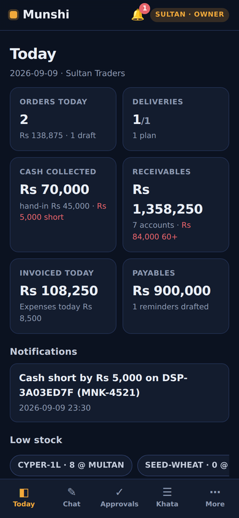 | 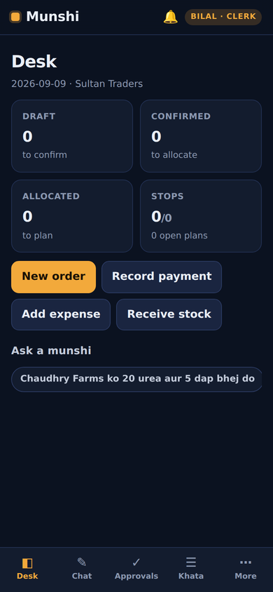 | 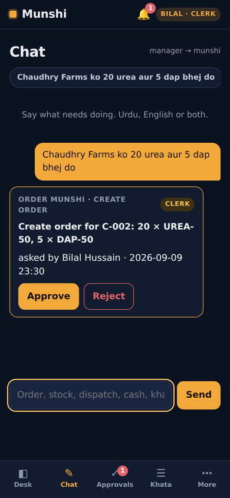 | 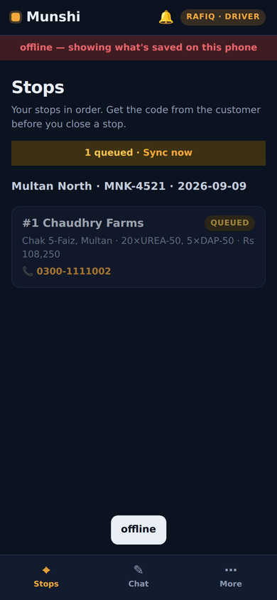 | 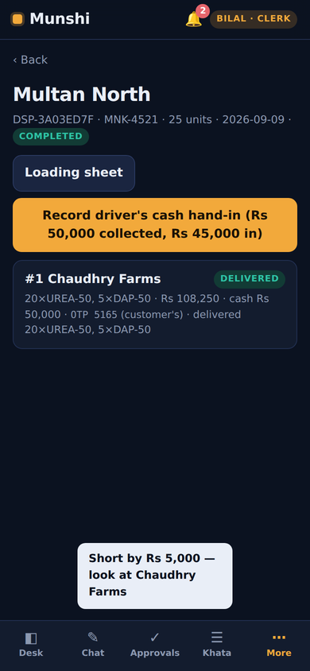 |

| Salesman: book | Khata | Profit report | Staff | Urdu |
|---|---|---|---|---|
| 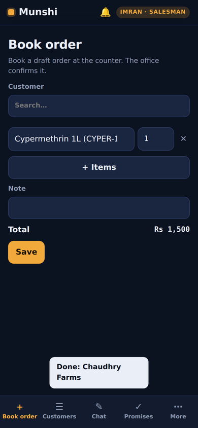 | 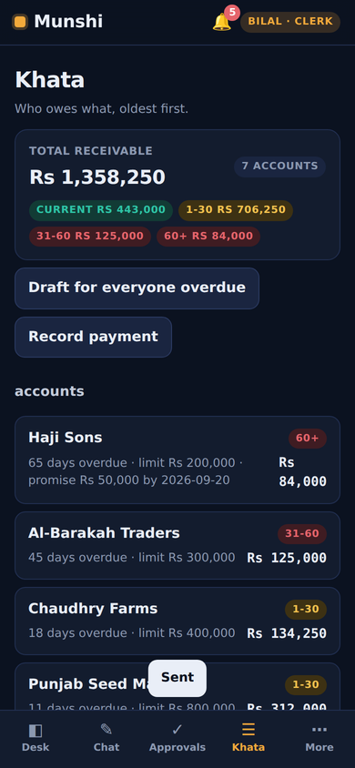 | 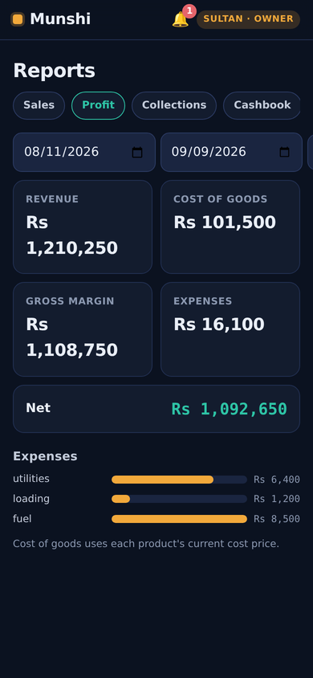 | 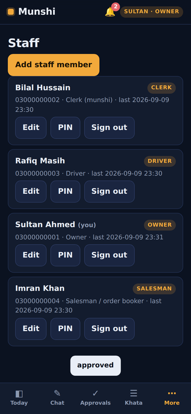 | 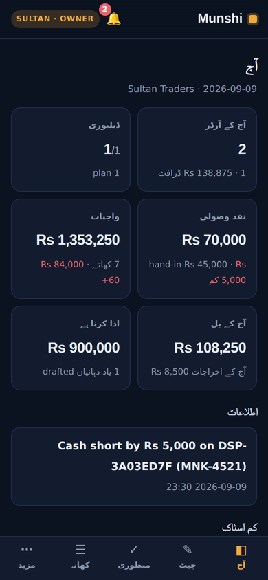 |

All 33 screens, captured by the CI walkthrough, are in [`docs/screens/`](docs/screens/).

## Run it

```bash
cp .env.example .env            # optional: keys and PINs
docker compose up               # http://localhost:8000
```

or without Docker:

```bash
pip install -r requirements.txt
PYTHONPATH=src python3 -m munshi.cli serve      # or: uvicorn munshi.web.app:app --host 0.0.0.0 --port 8000
```

Open it on a phone on the same Wi-Fi (`http://<your-pc-ip>:8000`), tap *Add to Home
Screen* — or install the APK from Releases and enter that address. Demo accounts:
**owner** 0300-0000001 / 1111 · **clerk** 0300-0000002 / 2222 · **driver** 0300-0000003 / 3333 ·
**salesman** 0300-0000004 / 4444. *Create your business* starts you with an empty godown and
an Excel template.

Tests, the scripted-day eval, the safety gate and the browser walkthrough:

```bash
pip install -r requirements-dev.txt && playwright install chromium
python3 -m pytest -q                       # 112 tests: domain, auth, tenancy, API, security, agents
python3 scripts/gate_ci.py                 # 39-step day through the agents, then the gate
python3 scripts/screenshots.py             # needs a running server on :8765 with a fresh demo DB
python3 scripts/loadtest.py --users 12     # 12 phones for 15 s: ~40 req/s, p95 < 60 ms on one core
```

## Configuration — where does the API key go?

**The app runs with no API key.** `LLM_PROVIDER=stub` (the default) uses a deterministic,
rule-based model that implements LangChain's tool-calling interface and understands the
catalogue — enough to run the demo, every test, and CI offline. It matches keywords; it
does not understand language.

Everything is in `.env` (see [`.env.example`](.env.example) for the full list):

| Variable | Needed for | Where to get it |
|---|---|---|
| `LLM_PROVIDER` | `stub` (default) or `groq` | — |
| `GROQ_API_KEY` | `LLM_PROVIDER=groq`, and voice orders (Whisper) | free at <https://console.groq.com> → API Keys |
| `WHATSAPP_TOKEN`, `WHATSAPP_PHONE_ID` | sending delivery codes, invoices, receipts, reminders | <https://developers.facebook.com/apps> → WhatsApp → API setup |
| `MUNSHI_SECRET` | signs public invoice links; **required in production** | `python3 -c "import secrets;print(secrets.token_hex(32))"` |
| `MUNSHI_ENV` | `development` or `production` (HSTS, closed sign-up, no API explorer) | — |
| `MUNSHI_DATA_DIR` | where the registry and each business's SQLite file live | any writable directory |
| `MUNSHI_DEMO` / `MUNSHI_SIGNUP` | seed the demo business / allow *Create your business* | — |

Nothing else changes when you switch providers: the agents, tools, gates, registry, app
and tests are provider-agnostic.

## Layout

```
src/munshi/
  auth/           registry.py (businesses, users, scrypt PINs, sessions, lockout) · principal.py (permission matrix) · ratelimit.py
  tenancy/hub.py  one SQLite file + one agent checkpoint file per business; sign-up; demo lifecycle
  domain/         models · migrations (versioned) · repository/ (base, master, orders, dispatch, cash, collections, reports, approvals) · seed
  tools/          core.py (framework-free) · langchain_tools.py (45 wrappers + error guard)
  safety/         risk.py (the registry) · middleware.py (HITL + role gating) · auth.py
  llm/            stub_model.py · parse.py (catalogue-aware Urdu/English parsing) · factory.py
  agents/         specialists.py (seven munshis, four roles) · manager.py · factory.py
  platform.py     chat → route → run → persisted approval → resume (SQLite checkpointer) · big-order escalation
  channels/       WhatsApp Cloud API adapter + outbox
  documents/      invoice/receipt/statement (HTML, PDF, signed public link) · Excel import/export/template
  web/            app.py (security headers, rate limits, scheduler) · deps.py (Principal, permissions) · routes/ (auth, setup, ops, money, reports) · static/ (the PWA: core.js, views.js, i18n.js)
  cli.py          serve · businesses · create-business · add-user · reset-pin · backup · migrate · demo-reset · check
mobile/           Capacitor Android shell → APK
eval/             scenario.py (39-step day) · run_eval.py (scores + registry-independent safety audit) · baseline
scripts/          gate_ci.py · screenshots.py (browser walkthrough, 4 roles) · loadtest.py
tests/            112 tests
docs/             ARCHITECTURE · SECURITY · DEPLOYMENT · QA · user guide · business/ · product/
```

## Honest limitations

- **The stub model matches keywords.** It exists so control flow — routing, gating, roles,
  approvals — is deterministic and testable without a key. Real comprehension is the Groq
  path. The catalogue-aware parser handles the demo's Roman-Urdu well; it is not a language
  model.
- **One process, SQLite.** Right for one business or a few hundred small ones on one VPS
  (see the load test); a fleet needs the registry on Postgres and a real limiter in front.
- **WhatsApp needs Meta's approval.** Without credentials messages queue with `wa.me` links
  and the clerk sends them by hand — which is how most small distributors do it today.
- **Android ships as an APK, not on the Play Store.** The Capacitor project builds an AAB
  with one command when you're ready to list it. No iOS build yet.
- **Batch/expiry tracking, GPS and GST e-invoicing** are on the [roadmap](docs/business/roadmap.md), not in v1.0.

## License

MIT
