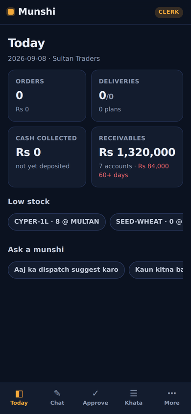
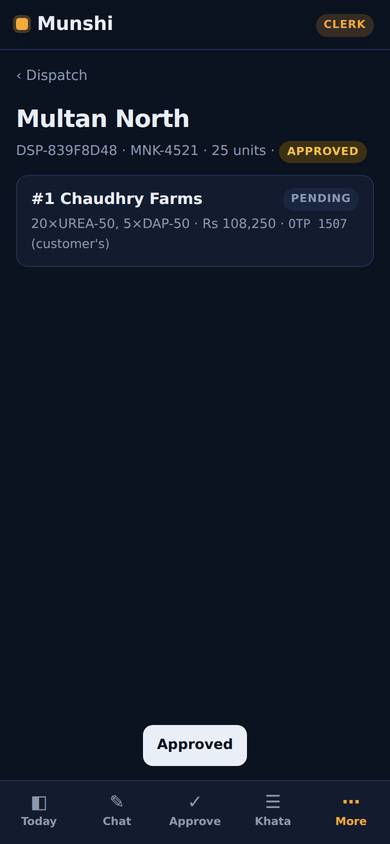
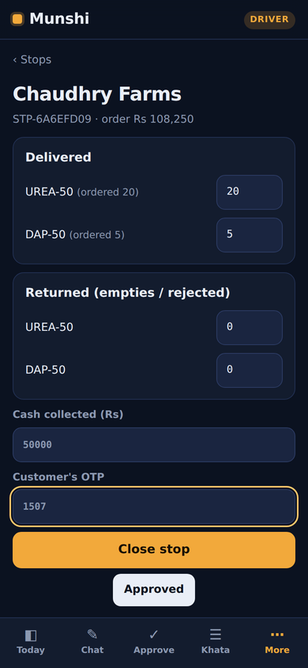
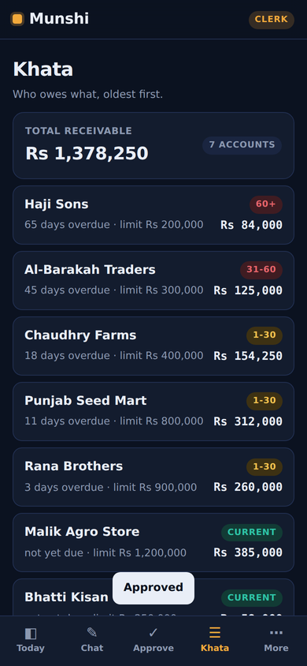

# Munshi

**Your AI back office, in your pocket.** A team of six approval-gated agents that
runs a small distributor's entire order-to-cash loop — orders, godown, deliveries,
cash, khata, collections — inside one self-contained mobile app. No ERP. No cloud
dependency. Nothing moves stock or money without a human saying yes.


Every distributor in Pakistan already has a *munshi* — the trusted clerk who takes
the orders, keeps the khata and chases the money. Munshi is that role as software:
five specialist agents with one job each and one set of permissions each, a manager
that routes and never acts, and a system of record they all write to through a
single door.

## The team

| Agent | Does | Can write | Can never |
|---|---|---|---|
| **Order Munshi** | Reads orders in Urdu, English or mixed; matches to real SKUs; checks stock and khata; drafts the order | `create_order`, `confirm_order` (clerk approves) | touch stock, money |
| **Godown Munshi** | Allocates against real stock, plans dispatch onto routes and vehicles within capacity | `allocate`, `plan`, `approve loading` (clerk); `adjust_stock` (owner) | promise stock that isn't there |
| **Delivery Munshi** | On the driver's phone: stops in order, closes each with what was delivered, returned, cash taken | `close_stop` — gated by the **customer's OTP**, not the app | close a stop without the code |
| **Hisaab Munshi** | Reconciles cash handed in against cash collected, per plan, and says which stop to look at | `record_deposit` (clerk); `credit_note` (owner) | post silently |
| **Wasooli Munshi** | Ages receivables, drafts reminders in the right tone, logs promises to pay | `draft`/`send_reminder`, `log_promise` (clerk) | write free text to a customer |
| **Manager** | Routes every message to one specialist; escalates | **nothing** | act |

## What makes it a product, not a demo

- **Approval by construction.** One risk registry (`safety/risk.py`) declares every tool's
  tier. LangChain's `HumanInTheLoopMiddleware` is generated from it, so any state-changing
  tool pauses the agent's graph and surfaces an approval card in the app. The action has
  not run. A human with the right role taps Approve or Reject; the agent resumes from its
  checkpoint. Registering a tool without a tier raises — the system fails closed.
- **Roles are tool boundaries.** A driver's Order Munshi has no `create_order` tool bound;
  refusing is the only thing it *can* do. A clerk can't even request a credit note. The
  owner is the only role that can approve money or stock adjustments.
- **The customer holds the key.** Every stop is closed against a four-digit OTP issued when
  the plan is approved. The driver never sees it — it's the customer's proof of delivery,
  and it's what the audit row records.
- **It's a real system of record.** SQLite, all invariants in one repository class: credit
  limits hold orders, capacity blocks plans, stock reserves on allocation and leaves on
  loading, returns restock, invoices and payments post on close, aging applies payments
  oldest-first the way a munshi does, and a short deposit is attributed to the stop most
  likely responsible.
- **A CI gate that proves it.** A 21-step scripted business day runs through the real
  agents on every push. Routing, gating and state-integrity get zero tolerance. The safety
  invariant — *no agent write to stock or money without a matching approval or OTP* — is
  checked from the audit log against a **hardcoded list of money/stock actions, independent
  of the registry**, so a bad registry edit can't exempt itself. Proven: un-gating
  `credit_note` fails the build with two named violations.
- **Errors are information.** A wrong OTP, an over-limit order, a plan that won't fit the
  truck — all come back to the agent as `{"error": …}` and become a sentence to the user,
  not a crashed turn.
- **Installable and offline-capable.** A PWA with a service worker: add to home screen,
  opens instantly, driver mode works with a flaky signal, syncs when it has one.

## A day in the app

```
clerk   Chaudhry Farms ko 20 urea aur 5 dap bhej do
        → Order Munshi wants to: Create order for C-002: 20 × UREA-50, 5 × DAP-50. Needs clerk approval.   [Approve]
clerk   confirm ORD-2C8BF3D7                                                                       [Approve]
clerk   allocate ORD-2C8BF3D7 at WH-MULTAN                                                         [Approve]
clerk   suggest dispatch for today
        → R-MULTAN-N: 1 order(s), 25 units → V-01
clerk   dispatch plan R-MULTAN-N V-01 ORD-2C8BF3D7                                                 [Approve]
clerk   approve DSP-8AF62C43                       ← stock leaves the godown, OTPs issued           [Approve]
driver  close STP-B74C1ECC delivered all cash 50000 otp 0000
        → Couldn't do that: OTP does not match the one issued for this stop
driver  close STP-B74C1ECC delivered all cash 50000 otp 9507
        → Stop closed: delivered, invoiced Rs 108,250, cash Rs 50,000
clerk   DSP-8AF62C43 driver handed 45000                                                            [Approve]
        → Deposit: expected Rs 50,000, counted Rs 45,000, variance Rs -5,000. Look first at: C-002
clerk   remind everyone over 30 days                                                                [Approve]
        → Drafted 2 reminders: C-009 (final, 65d), C-004 (firm, 45d)
clerk   credit note Rana Brothers 5000 damaged bags
        → Credit notes need the owner's approval.
owner   credit note Rana Brothers 5000 damaged bags → clerk tries to approve → blocked → owner approves
```

`PYTHONPATH=src python3 demo/run_demo.py` runs exactly this, offline.

## Screens

| Today | Chat + approval | Dispatch plan | Driver: close stop | Khata |
|---|---|---|---|---|
|  |  |  |  |  |

## Run it

```bash
pip install -r requirements-dev.txt
PYTHONPATH=src python3 -m uvicorn munshi.web.app:app --host 0.0.0.0 --port 8000
```

Open `http://<your-machine>:8000` on your phone (same Wi-Fi), tap *Add to Home Screen*.
Demo PINs: **owner 1111 · clerk 2222 · driver 3333** (set your own in `.env`).

Or with Docker:

```bash
docker compose up
```

Tests, the scripted-day eval, and the safety gate:

```bash
python3 -m pytest -q             # 45 tests
python3 scripts/gate_ci.py       # runs eval/scenario.py through the agents, then gates
```

## Configuration — where does the API key go?

**The app runs with no API key.** `LLM_PROVIDER=stub` (the default) uses a deterministic,
rule-based model that implements LangChain's tool-calling interface and understands the
catalogue — enough to run the demo, every test, and CI offline. It matches keywords; it
does not understand language.

For real language understanding, set these in `.env` (see `.env.example`):

| Variable | Needed for | Where to get it |
|---|---|---|
| `LLM_PROVIDER` | `stub` (default) or `groq` | — |
| `GROQ_API_KEY` | `LLM_PROVIDER=groq`, and voice orders | free at <https://console.groq.com> → API Keys |
| `LLM_MODEL` | optional | defaults to `llama-3.3-70b-versatile` |
| `OWNER_PIN` / `CLERK_PIN` / `DRIVER_PIN` | sign-in PINs | choose your own |
| `MUNSHI_SECRET` | signs session tokens | any long random string |
| `MUNSHI_DB` | SQLite file path | defaults to `munshi.db` |

Nothing else changes when you switch providers: the agents, tools, gates, registry, app
and tests are provider-agnostic. With a Groq key, the mic button appears in chat and voice
notes go through Whisper before reaching the Order Munshi.

## Layout

```
src/munshi/
  domain/        models, the SQLite repository (every business rule), demo seed
  tools/         core.py (framework-free) · langchain_tools.py (wrappers + error guard)
  safety/        risk.py (the registry) · middleware.py (HITL + role gating) · auth.py
  llm/           stub_model.py · parse.py (catalogue-aware Urdu/English parsing) · factory.py
  agents/        specialists.py (five munshis) · manager.py · factory.py
  platform.py    chat → route → run → approval card → resume
  web/           app.py (FastAPI + API) · static/ (the PWA)
eval/            scenario.py (21-step day) · run_eval.py (scores + safety audit) · baseline
scripts/         gate_ci.py · screenshots.py (Playwright walkthrough)
tests/           45 tests
demo/            run_demo.py
```

## Honest limitations

- **The stub model matches keywords.** It exists so control flow — routing, gating, roles,
  approvals — is deterministic and testable without a key. Real comprehension is the Groq
  path. The catalogue-aware parser handles the demo's Roman-Urdu well; it is not a language
  model.
- **Approvals live in process memory** (LangGraph's `InMemorySaver`). A restart drops
  pending approvals — not data, which is in SQLite. Swapping in
  `langgraph-checkpoint-sqlite` is the next step for a multi-day deployment.
- **PIN sessions, not accounts.** Three roles, three PINs, HMAC-signed tokens. Right for one
  business on one phone-per-role; a multi-business deployment needs real auth.
- **Reminders are drafted and marked sent; the SMS/WhatsApp send is a stub.** The channel
  adapter is the one integration deliberately left as a single function to plug in.
- **Mobile means PWA.** It installs to the home screen and works offline; it is not in an
  app store. A Flutter shell around this backend is a straightforward port.

## License

MIT
